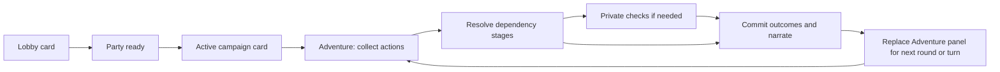

# D&D campaign panels and interaction specification

Status: planning draft, 2026-09-26. Companion to the [DM bot plan](dnd-dm-bot-plan.md). This defines intended behavior, not implemented UI. Rule names, values, and character options come from the verified baseline chosen for the campaign.

## Principles and message ownership

- The database owns characters, actions, rolls, timers, and progress. Discord messages display that state.
- Public panels show information available to the campaign audience. Player-specific choices and private information appear in ephemeral views.
- Shared messages cannot show different enabled buttons to different viewers. Enable shared buttons when at least one eligible actor can use them; enforce eligibility on every click and submission. Explain denied clicks privately.
- Campaign membership and role checks apply even if a user knows a component identifier. An enabled button is not authorization.
- Build panels with Discord Components V2 (containers, sections, text displays, thumbnails, media galleries, separators), as the settings panel already does (`src/infrastructure/discord/settings/panel/panel-messages.ts`). See [Display system](#display-system). Keep at most five buttons per row and at most two control rows on shared panels. Select menus occupy a separate row. Paginate large lists privately; do not fit an entire character sheet onto a public card.
- All button labels, status descriptions, validation messages, and templates support `en` and `zh-TW`. Use text labels alongside icons, readable contrast, and mobile-friendly lengths. Color alone never conveys readiness or failure.
- Pins are navigation shortcuts. The bot cannot create a fixed header, reserve message positions, or prevent an administrator from deleting a message.

## Display system

### Components V2

Every campaign panel is one V2 message: a container whose accent color reflects state, holding text displays, sections, separators, galleries, and action rows. Constraints to design within (verify against the installed discord.js, currently 14.27):

- A V2 message cannot also carry `content` or embeds.
- At most 40 components per message, counting nested ones, and about 4,000 characters of text across text displays.
- A section holds up to three text displays plus one accessory: a thumbnail or a button.
- A media gallery holds up to 10 images.
- Images are URLs or `attachment://` uploads; reuse stored assets rather than re-uploading on every edit.

Rendering budgets are enforced in code: if a projection would exceed a limit (six heroes with long names, many monsters), collapse detail into a private view rather than failing the send.

### State accents

| Accent | State |
| --- | --- |
| Green | Collecting actions; hero card present |
| Amber | Awaiting rolls or clarification |
| Red | Combat; encounter reveal |
| Blue | Private views (Act, turn, roll) |
| Gray | Paused, waiting for players, recovery, archived; narration and result history |

The state is always also written as text in the container heading. Color never carries meaning alone.

### History versus controls

Narration, scene art, encounter reveals, Speak lines, and roll/result lines are separate history messages and are never edited into the action panel. The action panel is the only live control message in Adventure and is replaced at round/turn boundaries (see the update contract). This keeps history readable when panels are replaced and keeps the panel within component limits.

### Character voices

Speak lines and optionally named-NPC dialogue post through a channel webhook using the speaker's name and portrait, so the hero appears to speak. Requirements:

- The bot needs Manage Webhooks in the Adventure channel. Setup checks this; if missing, fall back to a normal bot message formatted `**Borin:** …` and show the organizer a non-blocking notice.
- Reuse one campaign-owned webhook per channel and store its ID; recreate it through reconciliation if deleted.
- Suppress all mentions. Webhook messages carry a stable event identity for reconciliation like other deliveries.
- Webhook posts never carry controls.

### Labels and language

Show the English abbreviation next to stats, skills, and conditions, where players cross-check rules (敏捷 DEX, 隱匿 Stealth, 倒地 Prone). Class, spell, item, and monster names appear in the campaign language only, to keep mobile lines short. Button labels stay under about 12 characters in `en` and 6 in `zh-TW`.

### Dice moments

Rolling is the one thing every player does every round, so it should feel like an event and big moments should feel big. Presentation never changes a result: the roll is saved before anything animates, and a retry, restart, or repeated click shows the same saved dice.

**The roll sequence: anticipation first.** The reply is never instant. Discord only requires acknowledging the click within about 3 seconds, and the message can then be edited several times, so the reveal is staged. Clicking Roll saves the result first. Everything after that is theater over a known result:

| Beat | What the table sees | Default timing |
| --- | --- | --- |
| 0. Stakes | For stakes rolls only (see below), a public line posts before the dice: "Mira reaches for the trap's wire… **Roll to disarm**". Other players see the attempt, not just the aftermath. | Immediately on click |
| 1. The "?" die | The public result message appears in a rolling state: a d20 image with **?** on its face, "Mira is rolling…", and no numbers. The roller's private view mirrors it. | 0 s (this is the click acknowledgement) |
| 2. The die lands | Edit: the "?" face is swapped for the natural number only. A 20 or 1 already shows its gold or cracked style here, so the table reacts before the math. | +1.5 s |
| 3. The math | Edit: the modifiers add up: **17** + 5 DEX + 3 (Bless) = **25**. | +1 s |
| 4. The verdict | Edit: the DC or AC and the outcome: vs DC 15 — **Success**, plus the moment headline or tags. The accent color changes here. | +1 s |

This follows web dice rollers such as [d20roll.com](https://d20roll.com/) and [rolladie.net](https://rolladie.net/roll-a-d20-die): the die is shown first with an unknown face, then the number appears. Discord cannot run client-side animation, so each step is a message edit that swaps the image. Do not cycle fake numbers through edits to simulate spinning: every edit counts against rate limits, the frames would arrive unevenly, and a flickered 20 that turns into a 4 feels like a cheat. An optional animated GIF of the "?" die wobbling can replace the static image in beat 1 at no extra API cost.

The whole table watches one public message land, rather than the roller seeing a private result that is then copied out. The DC stays hidden until beat 4, so nobody knows whether 17 was enough until the verdict.

**Suspense scales with the stakes.** Routine rolls get beats 1, 2 and 4 only (math and verdict are merged; about 2.5 s). Stakes rolls get every beat, with a longer pause before the verdict. A roll counts as a stakes roll if it is a death save, an attack or save against a boss, a roll with a clock at its last segment, or a check the Planner marks as pivotal. For the deciding third death save, beat 2 holds for 3 s and the success and failure pips fill one at a time. Suspense has a cap of 6 s per roll, so the pacing never drags.

**Group rolls count up.** When several heroes roll together, such as a group Stealth check or initiative, one message reveals them one at a time in ascending order, so the best roll, and any natural 20, lands last. Each reveal is one edit about 0.8 s apart, and the combined verdict comes at the end.

**Damage gets its own beat.** After a hit, the damage dice appear as a row of "?" icons, then land as face icons with the total. A critical shows twice as many "?" dice, then the doubled row.

**Safety of the theater.** The staging is presentation only:

- The result is committed before beat 1.
- A restart mid-sequence resumes at the verdict with no replay.
- The Narrator job starts at click time, in parallel with the staging, so suspense costs no extra latency. Narration posts after the verdict.
- Edits are scheduled per channel and coalesced so they stay inside Discord's rate limits. If an edit fails or is rate limited, the next edit skips to the final state.
- Roll speed Fast or Off (see Settings), or Instant pacing, skips the middle beats.

**Moment tiers.** A pure classifier reads the saved roll and its context and returns at most one headline moment (highest tier wins) plus any number of small tags. Moments are tagged on the result event, so the Narrator, the result line, and the session recap all agree on what happened.

| Tier | Moment | Trigger (2014 rules) | Presentation |
| --- | --- | --- | --- |
| Legendary | Natural 20 on an attack | Critical hit: damage dice doubled | Gold accent, 🎲 **NATURAL 20 — CRITICAL HIT!** heading, the doubled dice shown as two rows, Narrator flourish |
| Legendary | Natural 20 on a death save | Hero regains 1 HP and wakes | Gold accent, **BACK FROM THE BRINK**, hero portrait |
| Legendary | Killing blow on the boss | Final damage drops a boss-tagged foe to 0 HP | Gold accent, monster art greyed, Narrator finisher |
| Disaster | Natural 1 on an attack | Automatic miss | Dark-red accent, **NATURAL 1**, Narrator describes the miss with flavor, never extra penalties |
| Disaster | Natural 1 on a death save | Counts as two failures | Dark-red accent, failure pips shown filling two at once |
| Clutch | Success by exactly 0 | Total equals the DC or AC | **Just enough!** tag |
| Clutch | A bonus die flipped the result | Bless, Guidance, or similar made the difference | **Blessed!** tag naming the source, e.g. "Bless turned a miss into a hit" |
| Clutch | Advantage saved it | The lower die would have failed | **Advantage saved you** with both dice shown, the loser struck through |
| Clutch | Reaction flipped it | Shield or similar turned a hit into a miss | **Blocked!** tag on the reaction line |
| Heartbreak | Failed by 1 | Total is exactly one below the DC or AC | **So close…** tag |
| Heartbreak | Third death save | The deciding save, success or failure | Suspense delay doubled; pips animate one at a time |
| Heartbreak | Disadvantage cost it | The higher die would have succeeded | Both dice shown, the lost one struck through |

Natural 20 and natural 1 on ability checks and saving throws get the flourish (gold or dark-red **Natural 20!** / **Natural 1**) but not an automatic result under the 2014 rules: the outcome still comes from the total. The UI never claims "automatic success" unless the house-rule option below is on. A natural 1 never adds a fumble penalty (dropped weapon, self-damage); that is not in the rules and players hate losing things to one die.

**Dice art.** Ship static assets, not generated images: a "?" face for every die size used in play (d20 first, then d4–d12 for damage; optionally a wobbling GIF version), and the numbered faces for each size. The d20 has a gold style for 20, a cracked dark style for 1, and a neutral style otherwise. Upload once, store the URLs, and reuse them. Damage rolls show small face icons in a row rather than one image per die, to stay inside component limits.

**Hidden rolls.** Hidden checks (the DM rolls privately) produce no public moment; the Narrator may describe the effect without revealing the number.

**The table remembers.** Moments feed three places:

- **Narrator input:** the headline moment is passed to the Narrator so it writes to it ("the blade finds the gap in the armor") instead of guessing from numbers.
- **Hero stats:** each hero card's details view counts natural 20s, natural 1s, and killing blows for the campaign.
- **Session recap:** "Dice of the night" names the session's best and worst roll and the luckiest and unluckiest hero by average d20. It is light-hearted and never shames: no public streak counters for bad luck during play.

**Settings.** Roll speed is a campaign display setting (not a house rule), named like d20roll.com's speed control:

- **Dramatic:** every beat on every roll, with longer pauses for stakes rolls.
- **Normal:** the staged sequence as described above.
- **Fast:** the "?" die, then the verdict in a single edit; headline and tags are still shown.
- **Off:** plain text result lines with no images or delay.

It defaults to Normal for Live and Fast for Play-by-post. Every moment is also written as text, so nothing relies on color, animation, or emoji alone.

## Confirmed two-channel layout

| Channel | Contents | Player permissions and behavior |
| --- | --- | --- |
| Party | Pinned campaign dashboard and persistent hero cards | Ordinary player messages disabled; controls open private views |
| Adventure | Bot narration, scene art, roll/results history, current action panel | Normal player messages disabled by default; players act through buttons, private views, and modals |
| Table Talk thread under Party | Coordination and social discussion | Members can send messages in the thread. Discussion does not submit actions, invoke DM resolution, or update campaign state |

Setup creates two text channels in the server's configured D&D category, or binds two existing channels, plus one Table Talk thread started from the Party dashboard (server setup and channel creation: plan §3). Deny ordinary player Send Messages in both parent channels by default, allow Send Messages in Threads for Party participants, and let the bot create/manage the designated thread. Check actual permission overwrites and campaign read access. A public thread inside a campaign-restricted Party channel is visible to that channel's audience; it is not a private place for character secrets.

Exclude the discussion thread from automatic campaign-state and generic-chat-memory ingestion, including ambient chat and channel-history scans. Any explicit future discussion-assistance feature requires its own scope. Keep player-created extra threads disabled by default so the designated discussion location remains clear.

### Discussion thread lifecycle

- Store `discussionThreadId` separately from dashboard message identity and link it through a Table Talk link button on the dashboard and the Adventure panel's More… menu. Navigation does not consume an action.
- Reuse the same thread across sessions. If it is automatically archived, reopen it when resuming an active campaign where permitted; do not create another thread or send artificial keepalive messages. Respect moderator locks and campaign archive rather than automatically overriding them.
- Dashboard deletion/repair first checks the saved thread. Preserve and relink a surviving thread even when its original starter message is gone. If the thread was deleted, organizer Repair may create a replacement and update links; deleted discussion history cannot be restored from campaign state.
- If permissions prevent access/reopening, show a private organizer recovery notice and retain the existing thread reference until resolved. Campaign archive closes the discussion thread according to the archive control and disables automatic reopening.

## Panel inventory

| Surface | Location/audience | Identity and lifetime |
| --- | --- | --- |
| Campaign/lobby card | Party, public to campaign audience | One logical `campaign-control` card; lobby transforms into active campaign controls |
| Hero card | Party, public projection | One `hero:<characterId>` card per accepted hero; edited in place |
| Adventure action panel | Adventure, public projection | One authoritative `action-control` slot; new message at each round/turn boundary |
| Combat overview | Included in the Adventure action panel | Public initiative/health bands and current actor; no second competing control message |
| Character creator / My Hero | Ephemeral to owner | Recreated on demand from saved draft/character |
| Act / pending roll / reaction view | Ephemeral to eligible actor | Reopened from current action/check state; submission does not depend on an old private message |
| Organizer controls | Ephemeral to organizer | Reopened from campaign state; consequential changes require a preview |
| Narrative, image, roll/result record | Adventure history | Durable output tied to scene/event; no permanent active game buttons |

Initially post the Party campaign card followed by hero cards in join order. Pin the dashboard; its roster links to each current hero card, the Adventure panel, and Table Talk. Player discussion stays in the thread so it does not bury the cards. Keep My Hero on the Adventure panel for direct access. Repaired cards may appear later; update dashboard links rather than reposting every card to restore ordering.

## Campaign card: lobby state

Display campaign/adventure name, organizer, exact rules revision, language, party size, pacing, and roster. Each member shows `Creating`, `Ready`, or `Away`; withdrawn members leave the active roster. An empty draft does not need a separate public hero message.

Example layout (illustrative values):

```text
MOONLIT RUINS — Lobby
3 / 6 players · Live · English
Rules: selected baseline + 2 house rules

Alex — Mira, Rogue — Ready
Sam  — Creating character
Jamie — Borin, Fighter — Ready

Waiting for Sam to finish or withdraw.
[Join] [My Character] [Leave] [Start Adventure]
[Rules & Settings] [Table Talk] [More…]
```

| Button | Behavior | Checks/result |
| --- | --- | --- |
| Join | Save membership and open private character hub | Capacity and lobby state; repeated join opens the saved draft |
| My Character | Open creator or accepted build review | Member only; no duplicate draft |
| Leave | Show private confirmation, then withdraw | Lobby membership; retain reusable draft separately |
| Start Adventure | Start once and transform card | Organizer only; minimum party and all registered heroes ready; transaction rechecks current revisions |
| Rules & Settings | Open paginated read-only public setup summary | Campaign visibility; hide private table notes and adventure secrets |
| Table Talk | Navigate to the saved discussion thread | Channel audience permissions; no gameplay mutation |
| More… | Private menu: Journal, Availability, and Organizer (organizer only) | Organizer role checked server-side when an organizer action is chosen |

Join is globally disabled at capacity or after start. Start is globally disabled while prerequisites fail; explain the missing prerequisite in the card. If Start is enabled, a non-organizer click still receives a private denial. Becoming unready disables Start on the next refresh; server validation closes the refresh race.

First click on Join opens a private hub, not a forced popup for other users. A registered organizer must create a hero if they intend to play; organizing alone does not consume a player seat.

## Private character creator

Private hub: **Use Preset · Create Character · Resume Draft · Withdraw** (show relevant choices only). Saved-character reuse can join this flow when supported; revalidate the copy under current campaign rules.

Wizard steps:

1. Identity: name, appearance, short backstory; portrait optional.
2. Build: supported class/background/other catalog selections.
3. Abilities: baseline-supported generation/allocation and derived preview.
4. Equipment/features: legal choices and initial resources.
5. Review: public-card preview, private fields, validation errors, and **Mark Ready**.

Use private selects for options and explicit buttons opening text modals. Buttons: **Back · Next · Save & Close** plus step-specific controls; never require nesting one modal inside another. Modal submission returns a private view with the next available action.

Persist each submitted step. Discord does not send text that someone typed into a modal and then cancelled: closing it preserves earlier submitted steps only. State this in helper text. A random ability-generation result is saved and reused when reopening; the UI cannot provide unlimited rerolls unless the rules explicitly allow them.

Mark Ready validates the full build and stores its character/rules revisions, creates or updates the public hero card, and refreshes the lobby. Editing a ready build removes readiness until confirmed again. Initial in-play builds are locked against arbitrary stat/equipment edits; supported progression and organizer correction use their own validated flows.

## Hero cards and My Hero

```text
┃ MIRA · 盜賊 · Lv 1                     ┌────────┐
┃ Played by Alex                         │portrait│
┃ ██████░░ HP 8/10 · AC 14               │ thumb  │
┃ Conditions: none · Present             └────────┘
┃ Round status: action submitted
┃ [Details] [My Actions] [Inventory]
```

The hero card is a section with the portrait as its thumbnail accessory, followed by an action row. **Details** shows the full-size portrait in a media gallery above the public sheet.

Portrait sources, in order of preference:

1. **Preset art** shipped with preset heroes.
2. **Player upload** during creation, stored through the guild asset store with the existing image type and size limits. The organizer can remove an inappropriate upload.
3. **One generated portrait** from the player's appearance text through the scene-image gateway, counted against the campaign image budget. The player may regenerate a limited number of times during creation only.
4. **Placeholder** with the hero's initials if none of the above is available.

Portraits never regenerate on HP, condition, or level changes; they change only when the owner replaces them. The portrait asset is also the reference for scene illustrations and the webhook avatar.

The public card shows portrait, public identity, level/class labels, HP, defense, conditions, away status, and one current participation/turn indicator. It does not expose private inventory, secret objectives, private drafts, or future actions awaiting round resolution. Update changed text only; reuse the stored portrait.

- **Details:** anyone with campaign access sees the public sheet in a private paginated response.
- **My Actions:** owner opens their legal choices, pending roll/reaction, or submitted action. An authorized proxy may use the granted action controls; proxy authority does not imply access to private notes.
- **Inventory:** owner sees their items and resource availability. Selecting Use produces a proposed gameplay action with target/cost preview; viewing never consumes an item. Other users receive a public equipment summary, with private fields excluded.

The common **My Hero** button opens the clicking user's character, rather than the hero belonging to whoever last edited the shared panel. Its private view includes Overview, Actions, Inventory, Notes, and Availability. Grant/revoke proxy access is an explicit owner action scoped to a named user, character, permitted resource use, and away status.

Recheck a proxy grant on submit, not just on view open. Owner return/revocation immediately removes proxy authority, including for already-open forms.

## Adventure action panel

Every panel shows scene title, campaign mode, round/turn identifier, public clock if any, roster readiness, and next required step. Use Discord relative timestamps for deadlines instead of editing the message every second. Display `No timer`, `Paused`, or `Waiting for players` explicitly when applicable.

Default exploration rows:

```text
┃ OLD WATCHTOWER · Exploration · Round 4
┃ Submit an action or Pass. Closes in 3 minutes.
┃ Mira ✓ Submitted · Borin … Thinking · Elin — Away
┃ [Act / Edit] [Speak] [Pass] [My Hero]
┃ [Safety] [More…]
```

Shared panels keep two control rows. Row 1 holds the gameplay actions for the current state; row 2 holds **Safety**, which stays one tap away in every non-archived state, and **More…**. More opens a private menu with Journal, Away / Return, Table Talk, Rules, and, for the organizer only, Organizer controls. Non-organizers never see a public Organizer button to be denied by.

**Act / Edit** opens the user's private action view with two or three suggestions, **Custom Action**, and the existing submission if any. A suggestion opens a preview; choosing it does not immediately spend resources. Custom Action opens a text modal. Submitting displays the attributed intent and any known cost for review, then **Submit Action** saves it for the round. **Edit** replaces it until close; **Withdraw Action** returns to Thinking. Instant mode commits immediately after Submit and has no revision window; say so in the private preview.

**Pass** records a reversible pass before round close. When the final eligible player submits/passes, the transaction closes the window immediately. Late edits receive a private explanation with their draft text retained for reuse. Marking ready is not a gameplay submission; lobby and round statuses have separate meanings.

**Speak** opens a dialogue modal and posts the player's words as their hero through the character-voice webhook (see [Character voices](#character-voices)), without generating NPC outcomes. Speaking neither fills the action slot nor consumes mechanical actions by itself. Persuasion, commands with mechanical effects, and other consequential requests must be submitted through Act. Render user text safely with mentions suppressed. Ordinary in-character messages, if enabled, follow the same checks and semantics.

**Away / Return** opens a private availability view. Explain the configured policy before confirming Away, including how an outstanding submission/check is treated. Returning becomes effective at the next normal boundary; if nobody was present, show Continue to the returning member to reopen waiting play. It does not grant permission to resume an organizer/recovery pause.

**Safety** opens a private request form available in all non-archived states. Requests are anonymous to other players and the organizer's UI; do not echo the reason publicly. Suspend unresolved gameplay while the request is handled, invalidate in-flight proposals, and preserve committed state. Skipping the presentation of content does not automatically undo mechanics; a rewind with mechanical effects follows the correction workflow. Never promise anonymity from service operators or audit infrastructure.

### State and control matrix

| State | Public status | Action behavior |
| --- | --- | --- |
| Collecting | Deadline and Submitted/Passed/Thinking/Away roster | Act/Edit, Speak, Pass available according to membership |
| Planning/resolving | DM is resolving the round | Act/Edit and Pass disabled; My Hero, Journal, Safety remain; Speak held to prevent racing the scene transition |
| Awaiting checks | Eligible heroes and count of pending public rolls | Main first button becomes My Pending Rolls; eligible actor opens saved checks; other players see waiting status |
| Clarification | Waiting for named player, with public-safe reason | Affected player can open Clarify; dependent work waits; unrelated committed results remain |
| Combat | Initiative, active hero, resource budget, public monster health bands | Act, Speak, End Turn, My Hero; Safety, More… on row 2; reactions are offered privately to eligible players (see Combat targeting) |
| Reaction window | Required responder where public | Reaction opens only eligible choices; Decline is private; underlying effect awaits resolution |
| Waiting for players / no actions | Explicit waiting status, no running deadlines | Availability and Continue, read-only views, Safety; no automatic model loop |
| Organizer/recovery pause | Reason and retained pending step | Read-only views, Safety, organizer Resume; no gameplay submissions |
| Archived | Campaign ended/archived | Read-only journal and public sheets; active buttons removed; automatic repair disabled |

Do not globally disable Act for everybody because one viewer is not the active hero. The current actor sees an enabled shared control, and other users receive a private message such as: "It is Borin's turn. You can inspect your hero or use an eligible reaction."

Combat controls open a private action menu with supported attack/spell/item/other choices and remaining costs. **End Turn** is explicit and validated against unresolved checks/reactions; when legal actions remain, show a private confirmation before ending. Timers use the main plan's remaining-budget policy, not an extra full autopilot turn.

### Encounter reveal and monster art

When combat starts, post one encounter reveal message in Adventure history before the combat panel: a red-accented container with the encounter name, a media gallery of the participating monster types, and a one-line roster ending in the initiative call.

- **Monster art library:** art is keyed by monster ID and art style, generated once through the scene-image gateway (or shipped with the starter adventure), stored as an asset, and reused across encounters and campaigns. Generating it counts against the image budget once; a missing image uses a text-only card, never blocking combat.
- **Grouped monsters:** identical monsters share one image and receive stable letters (Goblin A, Goblin B) in every list, result line, and target menu. Named NPCs use their own names.
- **Visibility:** only revealed monsters appear. Hidden or not-yet-arrived creatures are added by a later reveal message when they become visible.
- The combat panel itself lists monsters as text with zone and health band (unhurt / hurt / bloodied / near death) and no thumbnails, keeping it within component limits and compact on mobile. Heroes show exact HP.

```text
┃ AMBUSH ON THE STAIRS                        (history)
┃ [Goblin boss art] [Goblin art] [Wolf art]
┃ Goblin boss · Goblin A · Goblin B · Wolf — roll initiative.

┃ COMBAT · Round 1 · Borin's turn             (live panel)
┃ ▶ Borin ████░ 9/12
┃   Goblin A — unhurt · near
┃   Wolf — unhurt · near
┃   Goblin boss — unhurt · far
┃ [Act] [Speak] [End Turn] [My Hero]
┃ [Safety] [More…]
```

### Combat targeting

Targeting uses private views and select menus. Emoji reactions are not used: any user can add any reaction, reactions are public, have no confirm step, cannot be scoped to eligible actors, and are heavily rate-limited.

Turn flow for the active hero:

1. **Act** on the shared panel opens the private turn view for the active hero (or an authorized proxy). Other users receive a short private notice such as "It is Borin's turn."
2. The turn view shows remaining budget (action, bonus action, movement, reaction) and one button per legal action type: Attack, Cast, a class feature such as Second Wind, Move, Dodge, Item, **Custom action…**, and End turn. Unavailable options are omitted or explained, not shown as dead buttons.
3. Choosing an action with a target shows a **string select menu listing only legal targets**, each labeled with name/letter, zone, and health band. Targets out of range are left out, and a line explains why and suggests Move. Allies appear for healing and support. Multi-target effects use a multi-select with the rule's maximum. Select menus hold at most 25 options; paginate beyond that.
4. A **preview** computed by the engine shows the to-hit or save formula, damage/healing dice, resource cost, and advantage/disadvantage with their reasons. Buttons: **Roll**, **Change target**, **Back**. Nothing is spent before Roll.
5. **Roll** starts the persisted attack sequence below. Each step's roll is saved exactly once, and public template result lines post as each step commits, without a model call. The turn view refreshes with the remaining budget when the sequence completes.
6. **Custom action…** opens a text modal for creative actions ("swing from the chandelier"). These go to the Planner, which maps them to a supported action and check or asks for clarification; the preview step still applies before anything is spent.

Stale selections are rechecked on submit: if the target died, moved out of reach, or the budget changed, refresh the private view with an explanation instead of spending.

### Attack sequence and reaction windows

An attack is a persisted sequence, not a single roll. Each stage is saved with its own state, so a restart or a pending reaction resumes at the same stage and never rerolls.

| Stage | What happens | Public output |
| --- | --- | --- |
| 1. Declared | Attacker, target, weapon/spell, and modifiers fixed; costs reserved | – |
| 2. Attack rolled | d20 saved; raw total computed against current AC | "Goblin A attacks Borin: 17" (no hit/miss yet if a reaction window opens) |
| 3. Reaction window | Engine lists reactions whose trigger matches (for example Shield on being hit, Parry for a creature with that reaction). Opens only if at least one eligible, able responder exists; otherwise skipped | "Waiting for Borin's reaction" when public |
| 4. Hit determined | Final hit/miss/critical against AC after any reaction (Shield's +5 applies to this and later attacks until the caster's next turn) | "…vs AC 18 — miss" or "…— hit" |
| 5. Damage rolled | Only on a hit; damage saved; resistances applied | "Damage: 7 slashing" |
| 6. Applied | HP, concentration saves, 0 HP and death-save effects, conditions; reservations committed | Hero card and panel refresh |

Saving-throw effects use the same staging: declared → targets' saves rolled → reaction window if any trigger applies → effects applied.

**Movement is interruptible.** A Move action is declared as a path through zones. Before a creature leaves the engagement of a hostile creature that can react (without Disengage), the sequence stops at that point and opens an opportunity-attack window for each such creature. Each attack resolves through the stages above, and the movement then continues from that point if the mover can still move. The positioning contract (plan §5) defines engagement and reach.

### Reactions

When a trigger makes a D&D reaction available, the eligible player receives a private prompt, delivered as a mention-free notice in Adventure that opens their reaction view, for example: "Goblin A's attack roll is 17 against your AC 14. Use Shield? [Use] [Decline]". The prompt shows the cost and the reaction timer, and the attack sequence waits at stage 3. Only valid reactions are offered, and a reaction used is spent until the start of that creature's next turn. Monsters' reactions are chosen by their tactic profile without a model call. Play-by-post players can set standing reaction preferences in My Hero instead; a preference is evaluated once when its window opens.

### Rolls and reactions

Public waiting status contains no hidden check reason or result. **My Pending Rolls** opens only the user's eligible checks; list multiple independent checks privately with pagination. Each check has a stable identity, formula, public-safe purpose, deadline, and Roll button. Once rolled, show the saved result and disable the private Roll control. A repeated interaction retrieves the same result.

Public checks produce one result event/message, including dice, modifiers, total, and the saved DC when revealed. Hidden checks remain private according to the rules profile; they cannot leak through shared rosters, images, or public result records. A timeout auto-roll is explicitly labeled, follows the same check identity, and never rolls again on retry.

Reaction views show only valid reactions and legal target/cost information, plus Decline. A pre-declared preference applies only while its trigger and authorization remain valid. State changes between view and submit cause a private refresh, not an invalid spend.

## Active campaign card and organizer view

After start, transform the lobby card in place into a campaign overview: scene, mode, current actor/round, hero links, pacing, and session status.

Rows: **My Hero · Adventure · Journal · Rules · Table Talk** and **Availability · More…**. Organizer controls are reached through More… (shown only to the organizer) or `/campaign`. Adventure and Table Talk are navigation links to the current action panel and saved discussion thread; update them after replacement/recovery. Spectators can view only authorized public information and cannot invoke member actions.

Organizer view offers:

- Pause / Resume, with recovery timing choices when relevant.
- Close Round (also available to a configured party caller; cannot override another hero's intent or costs).
- Manage Roster and configure an allowed paused-session replacement; initial-release late joins remain disabled unless implemented.
- Rules/Settings, showing a before/after preview and affected readiness/state before applying.
- Whisper to DM, retained only in Planner context.
- Regenerate Narration, tied to the selected committed output without changing rolls/state.
- Correct State, with target/event selection, proposed changes, dependency checks, and explicit confirmation.
- Repair Panels and Rebind Channel, with resulting permissions checked before use.
- Archive, confirmed privately; retains records and disables gameplay/automatic card recreation.

Paginate these options rather than displaying all as shared public buttons. Non-organizers never see the Organizer entry in More…; a forged or stale organizer interaction still receives a brief private denial. Repairs, permission errors, and provider failures report here or through `/campaign status`, including when the original channel is inaccessible.

## Update, replacement, and restart contract



The campaign card remains in Party throughout this loop. Hero cards refresh from committed changes. Pause, waiting, combat, and recovery use the state matrix above.

1. Commit state first and enqueue a projection refresh/delivery event.
2. Render only the affected campaign/hero/action cards from current authoritative data. Coalesce bursts; do not regenerate card images for numerical changes.
3. Edit permanent Party cards in place. During a round/turn edit the current Adventure panel in place.
4. At a new actionable round/turn, deliver committed narration/results first, invalidate the old panel generation, then create/register the next action panel after that output. Remove old controls best-effort. If new-panel delivery fails, show a recoverable status and let `/campaign status` retry; never reactivate stale gameplay buttons.
5. Avoid adding future narration behind a stale active panel: a completed round or combat-turn boundary is the replacement point. Mid-turn mechanical results can appear below the panel; no need to repost for each roll or Speak message.
6. Image completion edits/attaches to its original scene record or posts a labeled scene attachment. It does not create a new action panel or advance a turn.

Logical panel identity, Discord message identity, panel generation, scene/round/turn identity, and state revision are separate fields. Treat changed game revisions according to action semantics: another player submitting in the same open round must not invalidate everyone's forms. Expire on changed eligibility/round/generation; use submission revision checks for conflicting edits to the same user's action. An already-open modal may still submit after a cosmetic panel repair if its bound game context and ownership remain valid; stale message buttons cannot open new gameplay flows.

Component identifiers are short opaque references to saved context and action kind, never a store for secret state. Validate the current message generation for shared-button events; bind private view/modal sessions to the actor and applicable game context. Store deduplication identities for both transport retries and logical action/check completion. A second click with a new Discord interaction ID still cannot roll the same check twice.

Deletion, startup, normal refresh, and Repair Panels use the same reconciliation path. Create only missing desired cards; reconcile uncertain prior sends before posting replacements. Bulk deletion should trigger one queued reconciliation, not one competing job per deleted card. Missing channels/permissions require organizer recovery, not repeated channel creation. Archive intentionally stops recreation.

Private views are conveniences, not durable sessions. Reopen them from My Hero/current controls after dismissal or expiry. Public cards and recovery workers use the bot's durable message API, not a stored interaction token. Routes are registered globally at startup; do not rely on process-local collectors to keep buttons working after restart.

Acknowledge interactions within Discord's initial response deadline. If opening a modal, return the modal as the initial response; do not defer and then try to open it. If preparation needs longer, defer a private reply and return a prepared Open Form button, which provides a fresh interaction. Long provider jobs update durable public state/output or can be checked through a fresh private view. Do not treat token expiry as a gameplay cancellation.

## Acceptance scenarios

1. Six heroes, long names, long inventory, and both languages fit the layout on mobile; overflow uses private pagination.
2. Lobby readiness and Start eligibility change together; a double Start creates one game.
3. A non-owner clicking a shared hero card never sees private fields; an authorized proxy gets only its granted controls.
4. Shared controls stay usable for eligible players while rejected clicks receive private explanations.
5. Cancelling a modal retains earlier saved steps but does not claim to save unsubmitted text; reopening shows the saved draft.
6. Another player's submission does not invalidate an open form in the same round. A round boundary, changed eligibility, or same-user edit conflict does.
7. Panel replacement leaves exactly one authoritative action slot; old controls are rejected even if Discord failed to remove them visually.
8. Restart restores shared-button routing and saved pending checks without needing the original private view/token.
9. Individual and bulk deletions recover cards without resetting heroes, duplicating checks, or replaying adventure initialization.
10. A completed roll is stable across repeated clicks and timeout races; a hidden check has no public metadata leak.
11. No-action/all-away waiting has no LLM or empty-round loop; recovering from downtime requires the configured explicit resume.
12. Delivery failures, missing permissions, and inaccessible channels have an organizer recovery path; archive suppresses repair.
13. End Turn, away mode, and proxy revocation cannot grant an extra action or use a revoked resource grant.
14. Safety suspends unresolved work and does not identify the requester publicly; mechanical rewind requires validated correction.
15. Delayed images and background summaries cannot move the current panel or overwrite newer gameplay.
16. Dynamic timestamps avoid per-second edit traffic; bursts of state changes coalesce while submissions validate fresh state.
17. Setup creates/binds Party and Adventure plus one Table Talk thread. Members can chat in the thread but cannot send ordinary messages in either parent by default; discussion never becomes a gameplay action or enters generic chat memory.
18. After a card is replaced, pinned dashboard links and Adventure My Hero still reach the current saved character without duplicate cards; discussion remains in its existing thread.
19. Resume reuses an automatically archived thread, respects moderator locks, and never duplicates a surviving thread when its dashboard is repaired. Deleted-thread recovery updates links and does not claim to restore deleted chat history.

20. Every panel renders within Components V2 limits for six heroes, eight monsters, and long `zh-TW`/`en` names; overflow moves detail into private views instead of failing.
21. Hero portraits display as thumbnails and are never regenerated by HP or condition changes; a missing portrait shows initials.
22. Encounter reveals show only revealed monsters; identical monsters get stable letters used consistently in lists, results, and target menus; missing art never blocks combat.
23. The target menu lists only legal targets; a target that dies or moves before Roll causes a private refresh, not a spend.
24. Only the active hero or authorized proxy can open the turn view; reactions prompt only eligible players and respect the reaction timer.
25. Speak lines post through the webhook with the hero's name and portrait and suppressed mentions; without Manage Webhooks they fall back to attributed bot messages.
26. Non-organizers never see a public Organizer button; Safety is one tap away in every non-archived state.
27. The roll is saved before the "?" die shows; a restart or repeated click mid-sequence reveals the same saved dice, never a new roll.
28. A natural 20 on an attack shows the critical-hit presentation with doubled damage dice; a natural 20 on an ability check shows the flourish but the outcome follows the total unless the natural-roll house rule is on.
29. Each saved roll gets at most one headline moment, and the same moment appears in the result line, the Narrator input, and the session recap.
30. Clutch tags name the real cause (the bonus die, the advantage die, the reaction) and only appear when that cause actually changed the outcome.
31. Roll speed Off produces plain text result lines with no delay; every moment is readable as text without color or animation.
32. The whole table sees one public roll message go through the "?" die, landed face, math, and verdict; the DC is hidden until the verdict; stakes rolls get the longer sequence and no roll's staging exceeds 6 s.
33. Group rolls reveal in ascending order with the highest last; narration latency is unchanged because the Narrator starts at click time.

## Sources and implementation checks

- [Discord component reference](https://github.com/discord/discord-api-docs/blob/main/developers/components/reference.mdx): button rows, component IDs, and supported layouts. Validate against the installed discord.js version before choosing components.
- [Interaction responses](https://github.com/discord/discord-api-docs/blob/main/developers/interactions/receiving-and-responding.mdx): initial response deadline, modal responses, ephemeral replies, and token lifetime.
- [Discord pin behavior](https://support.discord.com/hc/en-us/articles/221421867-Pin-Messages-FAQ): pins are navigation rather than fixed headers.
- [Discord webhook resource](https://github.com/discord/discord-api-docs/blob/main/developers/resources/webhook.mdx): executing webhooks with a custom username and avatar for character voices.
- [Discord thread permissions](https://github.com/discord/discord-api-docs/blob/main/developers/topics/permissions.mdx): sending in threads is controlled separately from sending in the parent channel.

Use the repository's existing persistent-panel and interaction-routing patterns, with campaign-scoped identities and authorization. Verify constraints with actual Discord payloads during milestone 1; static mock layouts alone are insufficient.
